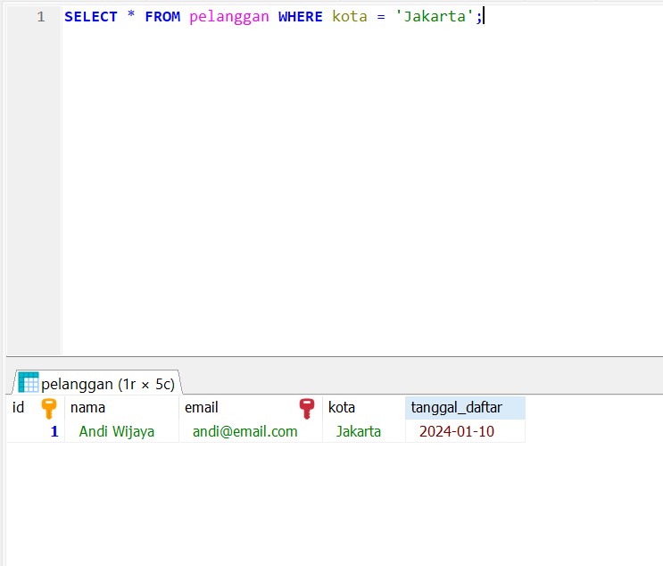
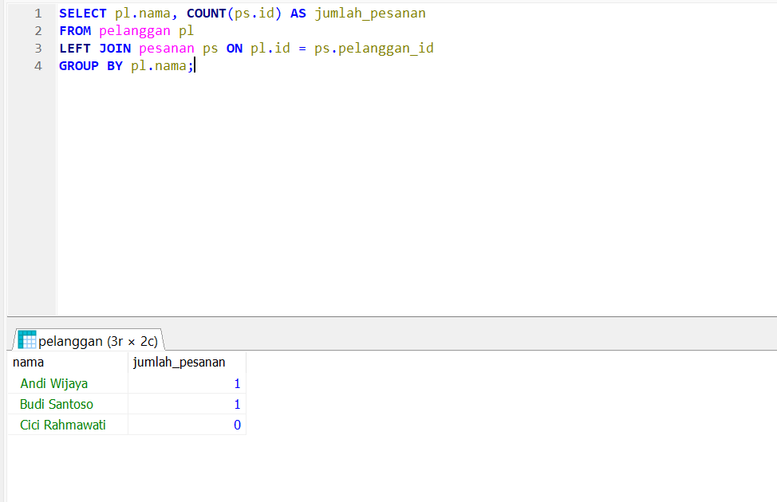
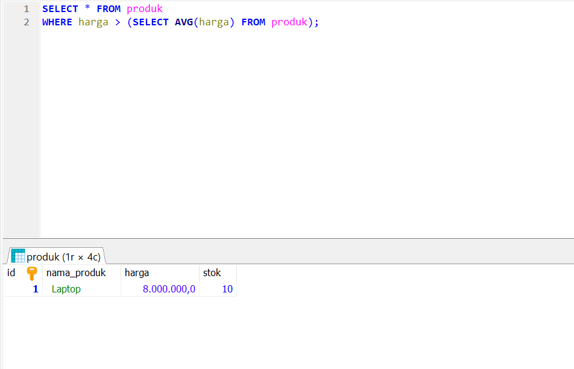

# Hari 1: Setup Lab & Dasar SQL

Tanggal : 24 Maret 2026  
Durasi  : 3 jam

## Tujuan Hari Ini
- [x] Install Laragon (MySQL di Windows)
- [x] Membuat database dan tabel
- [x] Mengisi data contoh
- [x] Latihan SELECT, WHERE, GROUP BY
- [x] Latihan JOIN (INNER, LEFT)
- [x] Latihan subquery sederhana

## Langkah-langkah

### Setup MySQL dengan Laragon

1. Download Laragon dari [laragon.org](https://laragon.org/download/)
2. Install, lalu jalankan Laragon.
3. Klik tombol Start All (segitiga hijau). Pastikan MySQL dan Nginx/Apache berjalan.
4. Akses MySQL:
   -CLI: Klik kanan pada MySQL → CLI, atau buka Command Prompt dan ketik `mysql -u root -p` (password kosong).
   -phpMyAdmin: Klik Database → phpMyAdmin (buka browser, login dengan user `root`, password kosong).

### Membuat Database dan Tabel

```sql
CREATE DATABASE toko_online;
USE toko_online;

CREATE TABLE pelanggan (
    id INT PRIMARY KEY AUTO_INCREMENT,
    nama VARCHAR(100) NOT NULL,
    email VARCHAR(100) UNIQUE,
    kota VARCHAR(50),
    tanggal_daftar DATE
);

CREATE TABLE produk (
    id INT PRIMARY KEY AUTO_INCREMENT,
    nama_produk VARCHAR(100) NOT NULL,
    harga DECIMAL(10,2),
    stok INT
);

CREATE TABLE pesanan (
    id INT PRIMARY KEY AUTO_INCREMENT,
    pelanggan_id INT,
    tanggal_pesan DATE,
    total DECIMAL(10,2),
    FOREIGN KEY (pelanggan_id) REFERENCES pelanggan(id)
);

CREATE TABLE detail_pesanan (
    id INT PRIMARY KEY AUTO_INCREMENT,
    pesanan_id INT,
    produk_id INT,
    jumlah INT,
    harga_satuan DECIMAL(10,2),
    FOREIGN KEY (pesanan_id) REFERENCES pesanan(id),
    FOREIGN KEY (produk_id) REFERENCES produk(id)
);

```

### Mengisi Data

```sql

INSERT INTO pelanggan (nama, email, kota, tanggal_daftar) VALUES
('Andi Wijaya', 'andi@email.com', 'Jakarta', '2024-01-10'),
('Budi Santoso', 'budi@email.com', 'Bandung', '2024-01-15'),
('Cici Rahmawati', 'cici@email.com', 'Surabaya', '2024-02-01');

INSERT INTO produk (nama_produk, harga, stok) VALUES
('Laptop', 8000000, 10),
('Mouse', 150000, 50),
('Keyboard', 300000, 30);

INSERT INTO pesanan (pelanggan_id, tanggal_pesan, total) VALUES
(1, '2024-02-10', 8150000),
(2, '2024-02-12', 300000);

INSERT INTO detail_pesanan (pesanan_id, produk_id, jumlah, harga_satuan) VALUES
(1, 1, 1, 8000000),
(1, 2, 1, 150000),
(2, 3, 1, 300000);

```

## Query yang Saya Coba

-- Select dengan Where 

```sql
SELECT * FROM pelanggan WHERE kota = 'Jakarta';

```

Berikut adalah hasil query `SELECT * FROM pelanggan`:



--INNER JOIN (2 tabel)

```sql

SELECT p.id, p.tanggal_pesan, pl.nama 
FROM pesanan p
INNER JOIN pelanggan pl ON p.pelanggan_id = pl.id;

```

Berikut adalah hasil query `INNER JOIN`:

.png)

--JOIN 3 tabel

```sql
SELECT dp.pesanan_id, pr.nama_produk, dp.jumlah
FROM detail_pesanan dp
INNER JOIN produk pr ON dp.produk_id = pr.id
INNER JOIN pesanan ps ON dp.pesanan_id = ps.id;

```

Berikut adalah hasil query `INNER JOIN`:

.png)

--LEFT JOIN

```sql
SELECT pl.nama, COUNT(ps.id) AS jumlah_pesanan
FROM pelanggan pl
LEFT JOIN pesanan ps ON pl.id = ps.pelanggan_id
GROUP BY pl.nama;

```

Berikut adalah hasil query `LEFT JOIN`:



--Subquery

```sql
SELECT * FROM produk 
WHERE harga > (SELECT AVG(harga) FROM produk);

```

Berikut adalah hasil SUBQUERY :



## Progress Checklist Install Laragon & MySQL

- CREATE DATABASE
- CREATE TABLE dengan PRIMARY KEY dan FOREIGN KEY
- INSERT data
- SELECT dengan WHERE
- INNER JOIN
- LEFT JOIN
- Subquery
- Window functions (hari 2)
- CTE (hari 2)

## Referensi

- MySQL Documentation
- W3Schools SQL Tutorial */