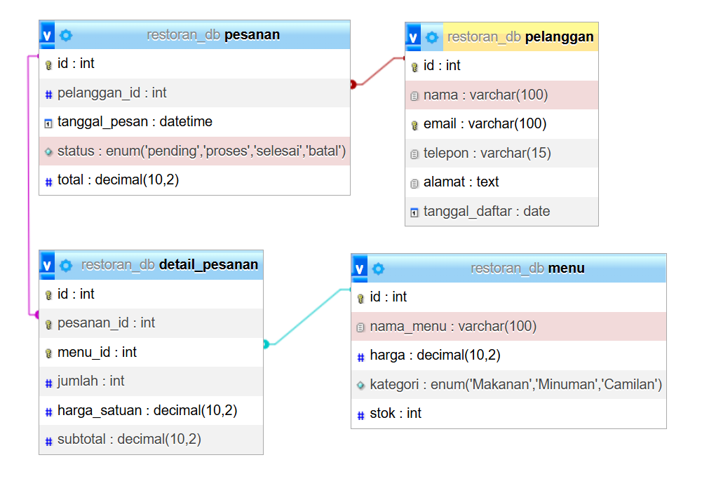

# Hari 3: Database Design (ERD, Normalisasi, Data Modeling)

Tanggal: 11 Juni 2026  
Durasi: 3 jam

## 🎯 Tujuan Hari Ini
- [x] Memahami ERD dan relasi tabel
- [x] Menerapkan Normalisasi (1NF, 2NF, 3NF)
- [x] Membuat skema database yang efisien
- [x] Memahami Star Schema dan Snowflake Schema

## 📊 ERD (Entity Relationship Diagram)

### Jenis Relasi

| Relasi | Contoh | Implementasi |
|--------|--------|--------------|
| One-to-One | 1 pelanggan → 1 kartu member | Bisa digabung jadi satu tabel |
| One-to-Many | 1 pelanggan → banyak pesanan | Foreign key di tabel pesanan |
| Many-to-Many | banyak pesanan → banyak menu | Junction table (detail_pesanan) |

### Contoh Relasi yang Saya Buat


## 📊 Normalisasi

### 1NF (First Normal Form)
Setiap kolom harus atomic (tidak boleh berisi array/list).

```sql
-- ❌ Melanggar 1NF
CREATE TABLE pesanan_salah (
    id INT PRIMARY KEY,
    menu_items VARCHAR(500)  -- berisi "Nasi, Teh, Pisang"
);

-- ✅ 1NF
CREATE TABLE pesanan_benar (
    id INT PRIMARY KEY,
    menu_item VARCHAR(100)   -- satu nilai per baris
); 

```

### 2NF (Second Normal Form)
Eliminasi ketergantungan parsial (untuk PK komposit).

```SQL
-- 1. Buat database
CREATE DATABASE latihan_desain;
USE latihan_desain;

-- 2. Buat tabel BURUK dan lihat hasilnya
CREATE TABLE pemesanan_buruk (
    id INT PRIMARY KEY,
    pelanggan_nama VARCHAR(100),
    produk_nama VARCHAR(100)
);
INSERT INTO pemesanan_buruk VALUES (1, 'Andi', 'Laptop'), (2, 'Andi', 'Mouse'), (3, 'Budi', 'Laptop');
SELECT * FROM pemesanan_buruk;  

``` 

Contoh sebelum 2NF:


```SQL
CREATE TABLE pelanggan_bagus (id INT PRIMARY KEY, nama VARCHAR(100));
CREATE TABLE pesanan_bagus (id INT PRIMARY KEY, pelanggan_id INT);
INSERT INTO pelanggan_bagus VALUES (1, 'Andi'), (2, 'Budi');
INSERT INTO pesanan_bagus VALUES (1, 1), (2, 1), (3, 2);
SELECT * FROM pelanggan_bagus; 

```

Contoh setelah 2NF:


### 3NF (Third Normal Form)
Eliminasi ketergantungan transitif.


## 📊 Studi Kasus: Normalisasi Toko Buku

Sebelum Normalisasi (Tabel buruk)

```sql
CREATE TABLE pemesanan_buruk (
    id INT PRIMARY KEY,
    pelanggan_nama VARCHAR(100),
    produk_nama VARCHAR(100)
);

```


Sesudah Normalisasi (4 tabel)


```sql

-- Tabel pelanggan
CREATE TABLE pelanggan_buku (id INT PRIMARY KEY, nama VARCHAR(100), alamat TEXT);

-- Tabel buku
CREATE TABLE buku (id INT PRIMARY KEY, judul VARCHAR(200), pengarang VARCHAR(100), harga DECIMAL(10,2));

-- Tabel pesanan
CREATE TABLE pesanan_buku (id INT PRIMARY KEY, pelanggan_id INT, tanggal_pesan DATE);

-- Tabel detail_pesanan (junction)
CREATE TABLE detail_pesanan_buku (id INT PRIMARY KEY, pesanan_id INT, buku_id INT, jumlah INT);

```

## 📊 Data Modeling Lanjutan
### Star Schema
1 Fact Table (data transaksi)

Beberapa Dimension Tables (data deskriptif)


### Snowflake Schema
Dimension Tables dinormalisasi menjadi sub-dimensions


### Perbandingan Star vs Snowflake

Aspek           Star                    Snowflake
Query       Cepat (lebih sedikit JOIN)	Lebih lambat (lebih banyak JOIN)
Storage     Lebih besar (redundansi)	Lebih hemat
Kemudahan	Sederhana                   Lebih kompleks

## Kendala & Solusi

Kendala                         Solusi
Sulit menentukan entitas        Cari kata benda dari studi kasus (pelanggan, produk, pesanan)
Bingung dengan Many-to-Many     Selalu butuh 3 tabel: dua entitas + satu penghubung
Lupa foreign key                Selalu set foreign key untuk menjaga integritas data

## Progress Checklist

- Memahami One-to-One, One-to-Many, Many-to-Many
- Menerapkan 1NF
- Menerapkan 2NF
- Menerapkan 3NF
- Normalisasi studi kasus toko buku
- Memahami Star Schema
- Memahami Snowflake Schema
- Membuat ERD dengan tools (hari berikutnya)

## Referensi

- Database Normalization
- MySQL Foreign Key