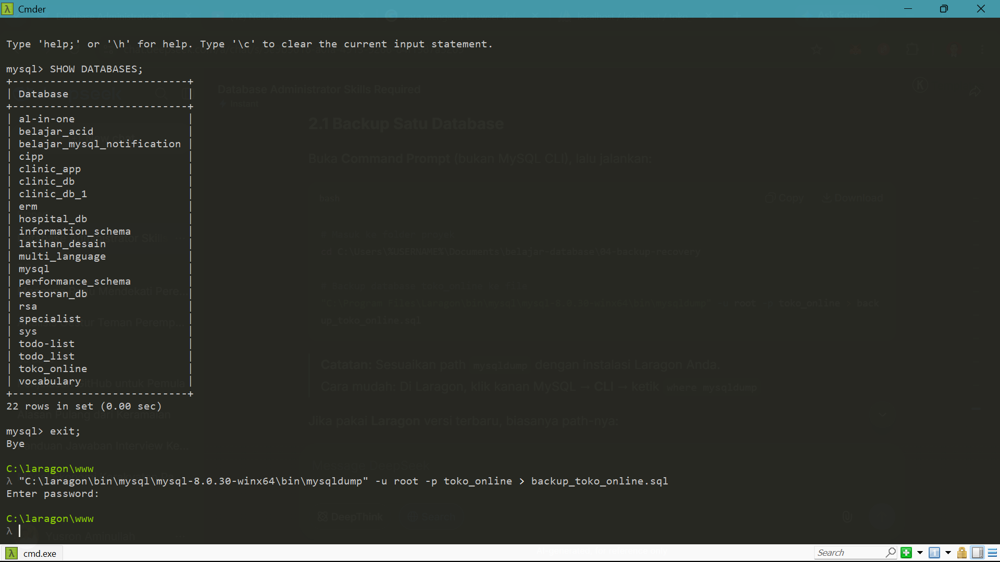
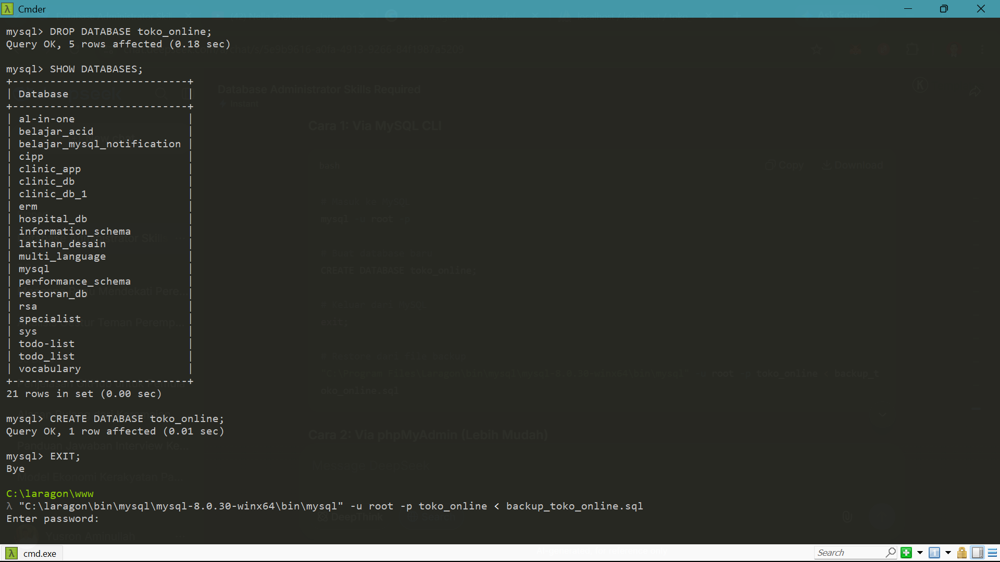
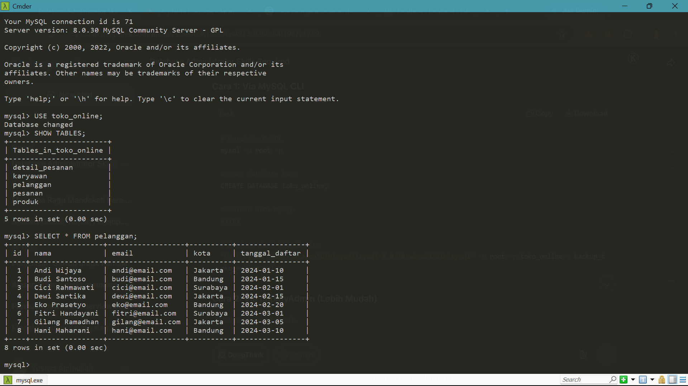
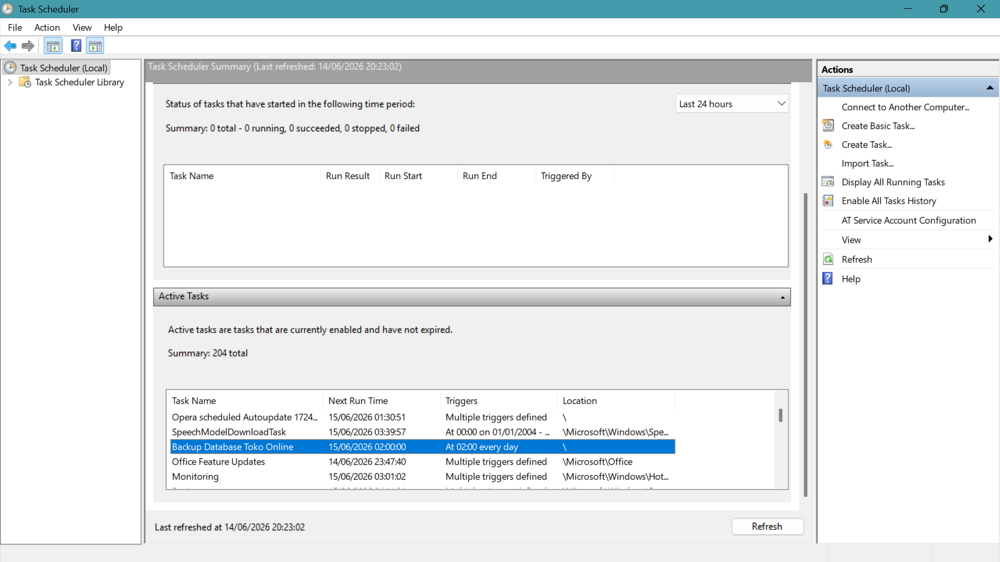

# Hari 4: Backup & Recovery Database

Tanggal: 14 Juni 2026  
Durasi: 2 jam

## 🎯 Tujuan Hari Ini
- [x] Backup database dengan mysqldump
- [x] Restore database dari backup
- [x] Backup otomatis terjadwal
- [x] Memahami Point-in-Time Recovery

---

## 📌 Backup dengan mysqldump

### Perintah Backup
```bash
mysqldump -u root toko_online > backup_toko_online.sql

```



## 📌 Restore Database

### 📌 Perintah Restore

```bash
mysql -u root toko_online < backup_toko_online.sql

```



### 📌 Verifikasi Restore

```sql
SELECT * FROM pelanggan;

```



## 📌 Backup Otomatis

```bash
@echo off
set BACKUP_DIR=C:\...\backup
set DATE=%date:~10,4%-%date:~4,2%-%date:~7,2%
mysqldump -u root toko_online > %BACKUP_DIR%\backup_%DATE%.sql

```

## 📌 Penjadwalan

- Menggunakan Windows Task Scheduler
- Jadwal: Setiap hari jam 02:00



## 📌 Point-in-Time Recovery (PITR)

Konsep: Mengembalikan database ke waktu tertentu sebelum terjadi kesalahan.

Cara:

- Backup full sebagai base
- Binary log mencatat semua perubahan
- Restore base + replay binary log
- hingga waktu yang diinginkan

## 📝 Ringkasan yang Saya Pelajari

Perintah                            Fungsi
mysqldump -u root db > file.sql     Backup database ke file
mysql -u root db < file.sql         Restore dari file backup
SHOW MASTER STATUS                  Lihat posisi binary log
Windows Task Scheduler              Jadwalkan backup otomatis

## Progress Hari 4

- Backup database dengan mysqldump
- Restore database dari backup
- Membuat script backup otomatis
- Memahami konsep PITR
- Praktek PITR (hari berikutnya)

## 🔗 Referensi

- MySQL Backup and Recovery
- mysqldump Documentation
