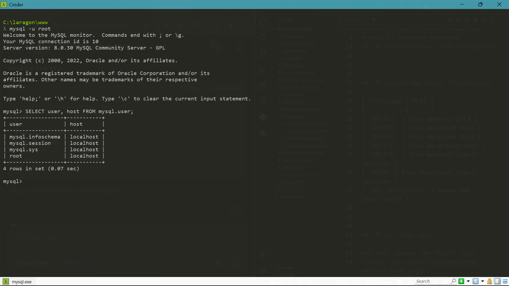
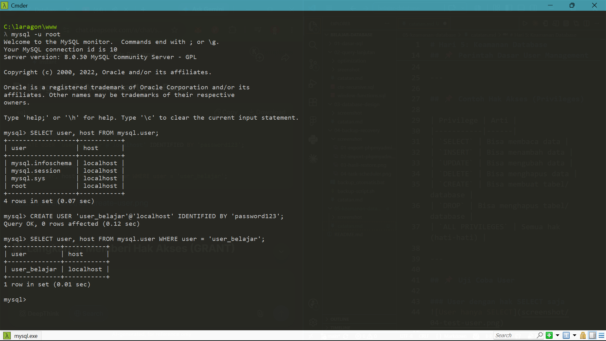
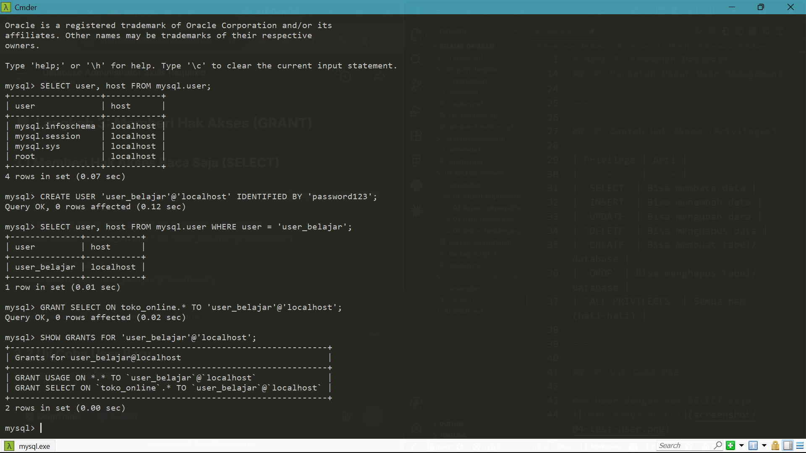
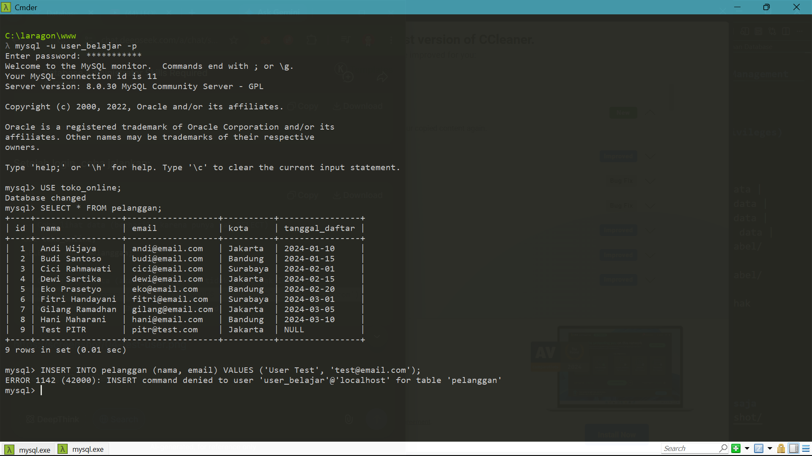
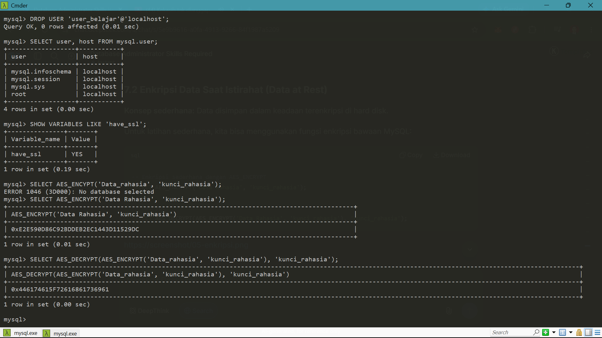
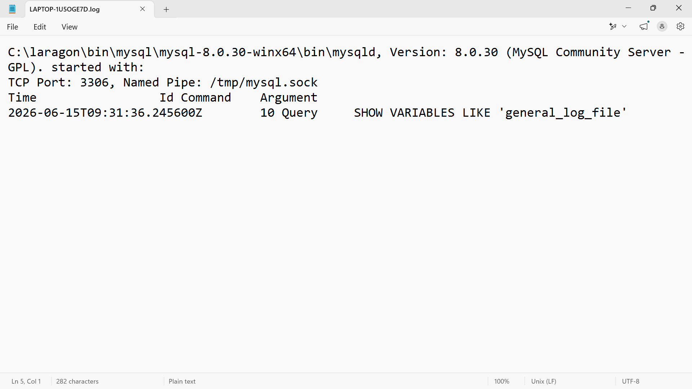

# Hari 5: Keamanan Database

Tanggal: 15 Juni 2026  
Durasi: 2 jam

## 🎯 Tujuan Hari Ini
- [x] Membuat user database
- [x] Memberi dan mencabut hak akses (GRANT/REVOKE)
- [x] Memahami konsep enkripsi
- [x] Audit log sederhana

---

## 📌 Perintah Dasar User Management

| Perintah | Fungsi |
|----------|--------|
| `CREATE USER 'nama'@'host' IDENTIFIED BY 'password'` | Membuat user baru |
| `GRANT hak ON database.* TO 'user'@'host'` | Memberi hak akses |
| `REVOKE hak ON database.* FROM 'user'@'host'` | Mencabut hak akses |
| `SHOW GRANTS FOR 'user'@'host'` | Melihat hak akses user |
| `DROP USER 'user'@'host'` | Menghapus user |
| `ALTER USER 'user'@'host' IDENTIFIED BY 'new_password'` | Mengubah password |

---

## 📌 Contoh Hak Akses (Privileges)

| Privilege | Arti |
|-----------|------|
| `SELECT` | Bisa membaca data |
| `INSERT` | Bisa menambah data |
| `UPDATE` | Bisa mengubah data |
| `DELETE` | Bisa menghapus data |
| `CREATE` | Bisa membuat tabel/database |
| `DROP` | Bisa menghapus tabel/database |
| `ALL PRIVILEGES` | Semua hak (hati-hati) |

---

## 📌 Melihat User yang Sudah Ada

```sql
-- Lihat semua user MySQL
SELECT user, host FROM mysql.user;

```


## 📌 Membuat User Baru

```sql
-- Buat user baru dengan password
CREATE USER 'user_belajar'@'localhost' IDENTIFIED BY 'password123';

-- Cek apakah user sudah terbuat
SELECT user, host FROM mysql.user WHERE user = 'user_belajar';

```



## 📌 Memberi Hak Akses(GRANT)

### Memberi Hak Akses Baca Saja (SELECT)

```SQL
-- Beri hak hanya bisa SELECT di database toko_online
GRANT SELECT ON toko_online.* TO 'user_belajar'@'localhost';

-- Lihat hak akses user
SHOW GRANTS FOR 'user_belajar'@'localhost';

```



## 📌 Uji Coba User

### User dengan hak SELECT saja
```sql
mysql -u user_belajar -p
# Masukkan password: password123

-- Coba lihat data (berhasil, karena punya hak SELECT)
USE toko_online;
SELECT * FROM pelanggan;

-- Coba insert data (akan gagal, karena tidak punya hak INSERT)
INSERT INTO pelanggan (nama, email) VALUES ('User Test', 'test@email.com');
-- Hasil: ERROR 1142: INSERT command denied

```


---

## 📌 Enkripsi Sederhana

```sql
-- Enkripsi data
SELECT AES_ENCRYPT('Data Rahasia', 'kunci');

-- Dekripsi data
SELECT AES_DECRYPT(data_terenkripsi, 'kunci');

```



## 📌 Audit Log Sederhana

```sql
-- Cek status general log
SHOW VARIABLES LIKE 'general_log%';

-- Aktifkan general log (HATI-HATI: akan membesar cepat)
SET GLOBAL general_log = 'ON';

-- Lihat lokasi file log
SHOW VARIABLES LIKE 'general_log_file';

```



Offkan setelah latihan

```sql
SET GLOBAL general_log = 'OFF';

```

## 📌 Best Practice

Aturan                                  Penjelasan
Least Privilege                         Beri hak seminimal mungkin yang dibutuhkan
User berbeda untuk kebutuhan berbeda	App, backup, monitoring pakai user sendiri
Password kuat	                        Minimal 8 karakter, kombinasi huruf+angka+simbol
Jangan pakai root untuk aplikasi	    Root hanya untuk administrasi
Hapus user yang tidak digunakan         Kurangi risiko keamanan

## ✅ Progress Hari 5

- Membuat user baru
- GRANT (memberi hak akses)
- REVOKE (mencabut hak akses)
- Menghapus user
- Memahami konsep enkripsi
- Audit log sederhana

## 🔗 Referensi

- MySQL Access Privilege System
- MySQL Encryption