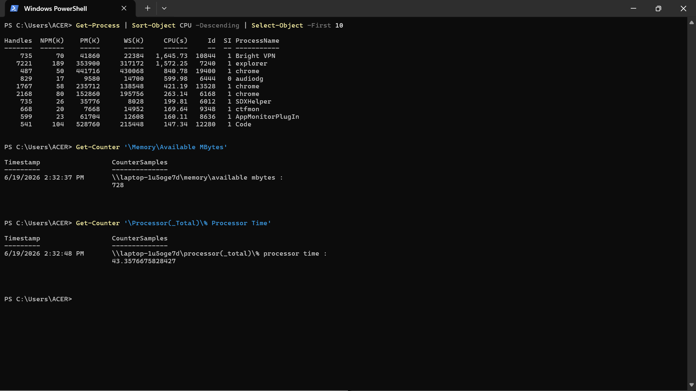
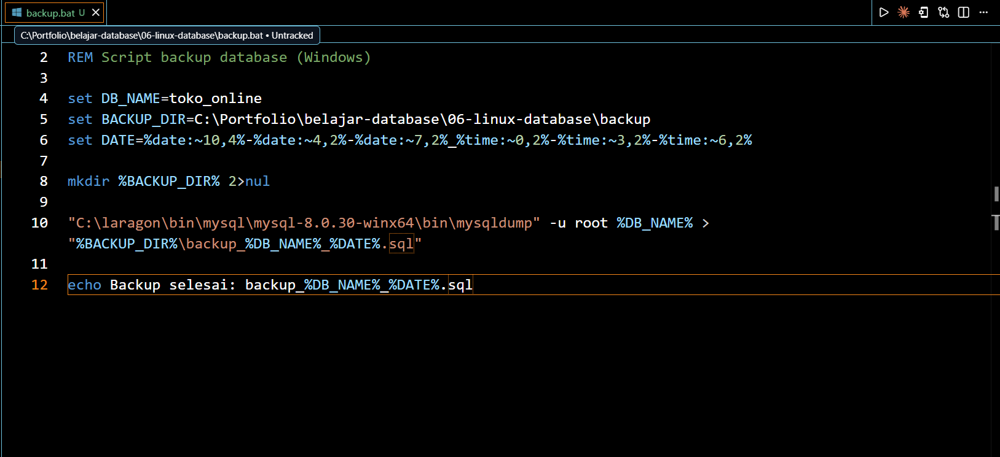

# Hari 6: Windows Basic untuk Database

Tanggal: 19 Juni 2026  
Durasi: 2 jam

## Tujuan Hari Ini
- [x] Perintah navigasi dan file di Windows
- [x] Manajemen proses dan service
- [x] Monitoring resource (CPU, RAM, Disk)
- [x] Script backup di Windows

---

## Perintah Windows vs Linux

| Linux | Windows | Fungsi |
|-------|---------|--------|
| `ls` | `dir` | Lihat isi folder |
| `pwd` | `cd` | Lihat folder saat ini |
| `cat` | `type` | Lihat isi file |
| `cp` | `copy` | Copy file |
| `mv` | `move` | Pindah file |
| `rm -rf` | `rmdir /s` | Hapus folder |
| `ps aux` | `tasklist` | Lihat proses |
| `kill -9` | `taskkill /F` | Matikan proses |
| `df -h` | `wmic logicaldisk` | Kapasitas disk |
| `free -h` | `wmic os get` | RAM |
| `cron` | Task Scheduler | Penjadwalan |

---

## Monitoring Via Command Prompt



---

## Service MySQL

Service MySQL bisa diatur via:
1. Laragon (Start/Stop)
2. Services (`services.msc`)
3. Command: `net start/stop MySQL`


---

## Script Backup (Windows)

```batch
@echo off
set DB_NAME=toko_online
set BACKUP_DIR=C:\...\backup
set DATE=%date:~10,4%-%date:~4,2%-%date:~7,2%

mysqldump -u root %DB_NAME% > "%BACKUP_DIR%\backup_%DB_NAME%_%DATE%.sql"

```



## Progress Hari 6

- Navigasi folder di Windows (CMD/PowerShell)
- Melihat dan mengedit file
- Manajemen proses (tasklist, taskkill)
- Monitoring dengan Task Manager
- Membuat script backup .bat
- Memahami Task Scheduler

## Referensi

- Linux Command Line Tutorial
- MySQL on Linux