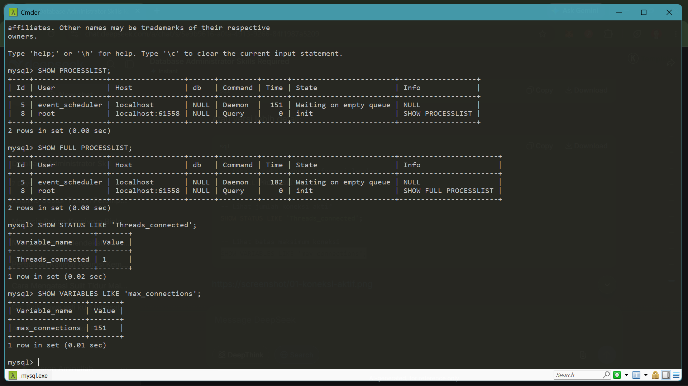
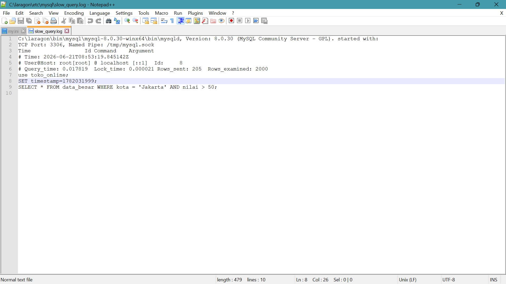
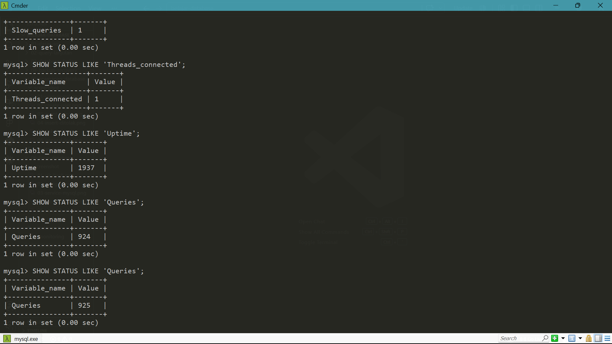
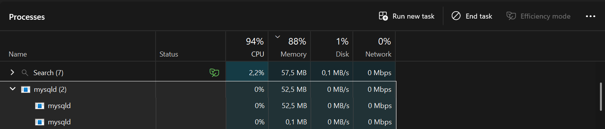

# Hari 7: Monitoring Database & Capacity Planning

Tanggal: 21 Juni 2026  
Durasi: 2 jam

## Tujuan Hari Ini
- [x] Melihat koneksi aktif
- [x] Mengidentifikasi slow query
- [x] Monitoring performa database
- [x] Capacity planning sederhana

---

## Koneksi Aktif

```sql
-- Lihat semua koneksi
SHOW PROCESSLIST;

-- Jumlah koneksi
SHOW STATUS LIKE 'Threads_connected';

```



## Slow Query Log

Aktifkan Slow Query

```bash
[mysqld]
slow_query_log = 1
long_query_time = 2

```

Identifikasi Query Lambat

```sql
SELECT * FROM data_besar WHERE kota = 'Jakarta' AND nilai > 50;

```



## Status Database

```sql
SHOW STATUS LIKE 'Uptime';        -- Lama server berjalan
SHOW STATUS LIKE 'Questions';     -- Total query
SHOW STATUS LIKE 'Slow_queries';  -- Jumlah query lambat
SHOW STATUS LIKE 'Threads_connected'; -- Koneksi aktif

```



## Capacity Planning

```sql
SELECT 
    table_schema AS 'Database',
    ROUND(SUM(data_length + index_length) / 1024 / 1024, 2) AS 'Size (MB)'
FROM information_schema.tables
GROUP BY table_schema;

```

Estimasi

Database            Ukuran Saat Ini         Estimasi 12 Bulan
toko_online	        5 MB	                30 MB
latihan_desain	    1 MB	                5 MB


## Resource Monitoring dengan Windows

Task Manager digunakan untuk memantau CPU, RAM, dan Disk.



## Ringkasan Perintah Monitoring

Perintah                                    Fungsi
SHOW PROCESSLIST                            Lihat koneksi aktif
SHOW STATUS                                 Lihat statistik server
SHOW ENGINE INNODB STATUS	                Lihat status InnoDB
SHOW VARIABLES	                            Lihat konfigurasi server
SELECT * FROM information_schema.tables     Lihat ukuran tabel

## Progress Hari 7

- Melihat koneksi aktif
- Slow Query Log
- Status database
- Monitoring dengan phpMyAdmin
- Capacity planning sederhana
- Resource monitoring Windows

## Referensi

- MySQL Performance Schema
- MySQL Monitoring